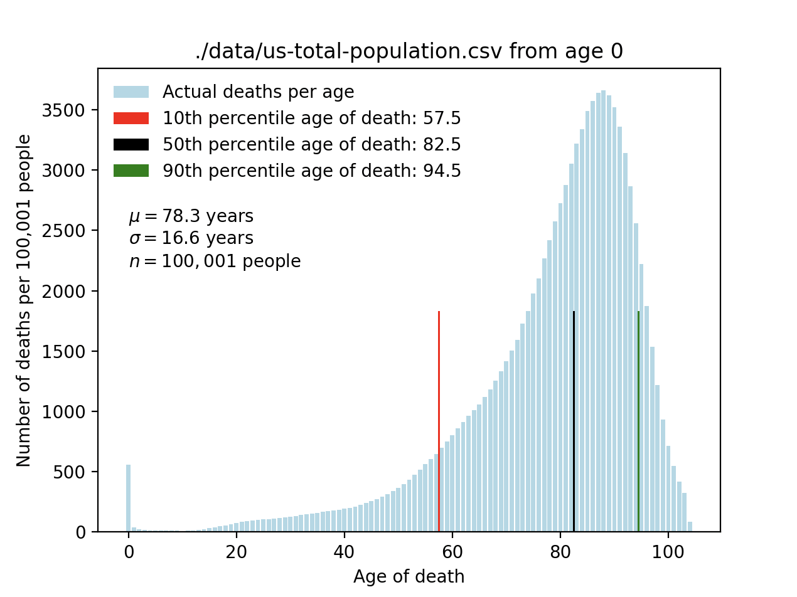

# Life Expectancy

This is a (likely flawed) attempt to understand the distribution of how much
life one can expect to live, given the fact that you've lived as long as you
have already.

An example of running the script:



## Statistics

**My background with statistics is fairly weak, so I've likely made some horrible
assumptions.** Feel free to call out whatever you see and add it as an issue to
the repo to warn others. Also feel free to make a PR to fix the issue.

## Data

I got this data from the CDC, and it is U.S. data. By default, the script runs
on data that includes the U.S. general population. You can also modify the
script to run on data specific to certain demographics.

See `data/README.md` and `data/raw-data/README.md` for more.

## Running the Script

To run the script, you'll need to have Python 3.9 installed. Then run:

```bash
# Install dependencies
python3 -m venv venv
source venv/bin/activate
pip install -r requirements.txt

# Run the script
python3 analyze.py --min-age [your_age_of_interest]
```
